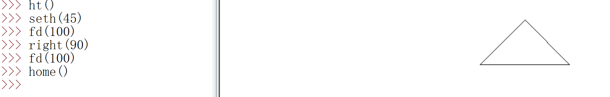
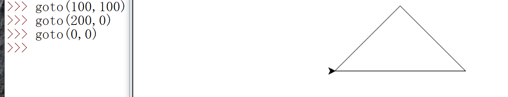
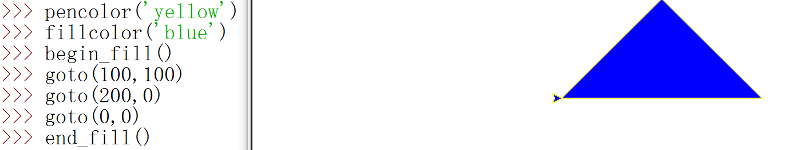
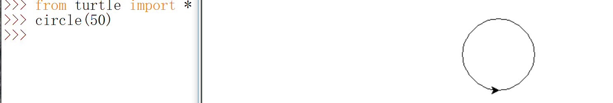
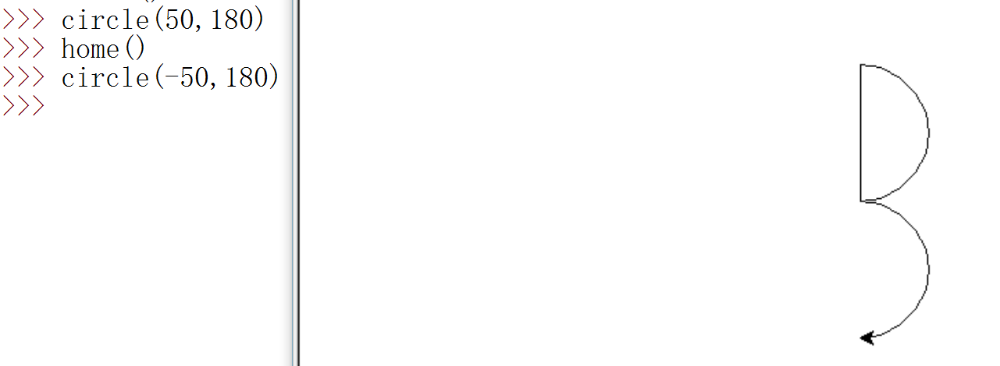
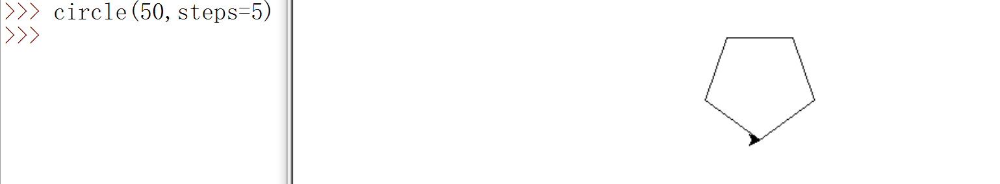
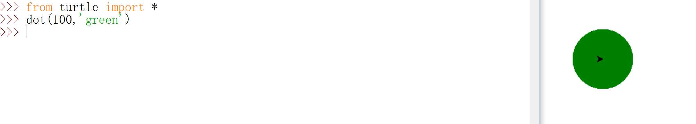
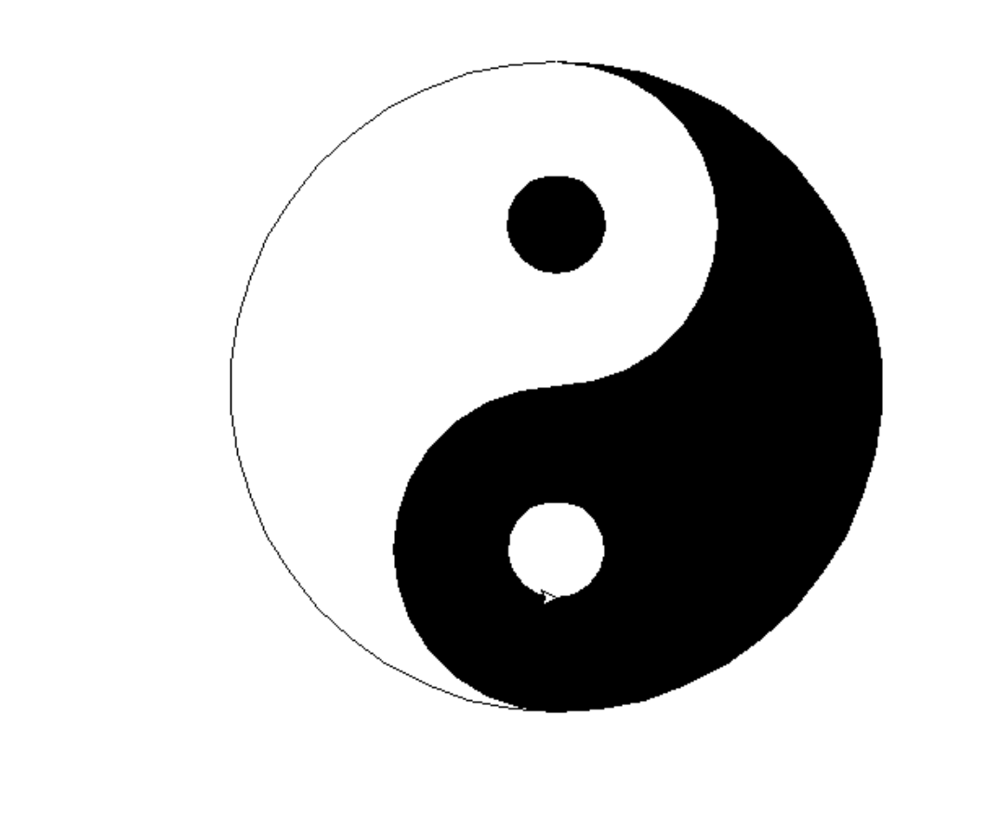

## 画几何图形
### 1.使用相对运动的方式画三角形
 
>ht()将画笔隐藏  
home()回到画布中心
### 2.使用绝对运动的方式画三角形 
 
### 3.使用颜色填充图形‘
 
练习(1)： 
>画出一个五角星,填充颜色为黄色 

### 4.画圆或者多边形
1.画圆  
 
2.画弧形  
 
3.画多边形  
 
### 5.画点 
 
练习(2)： 
>画出一个太极图 

