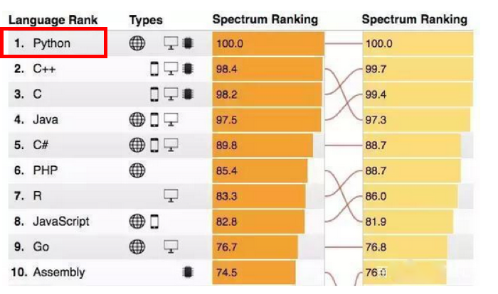
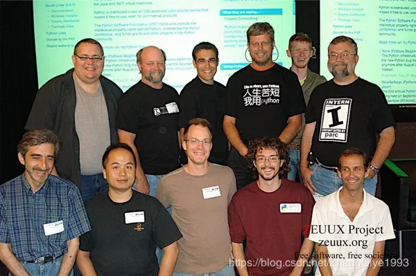
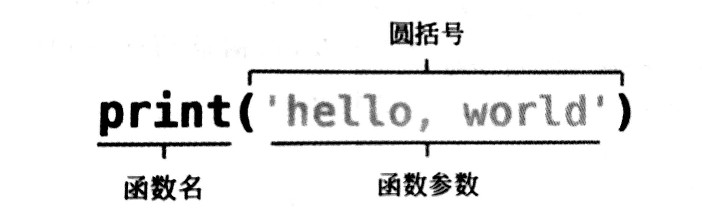
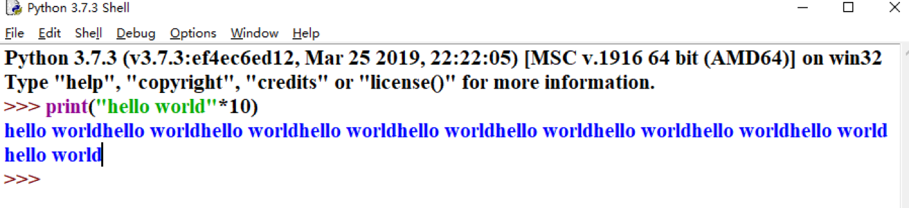
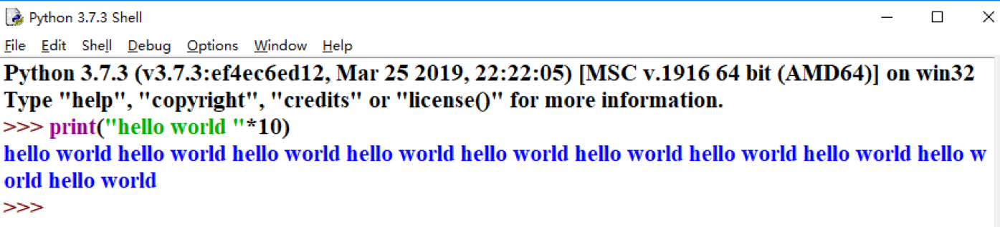
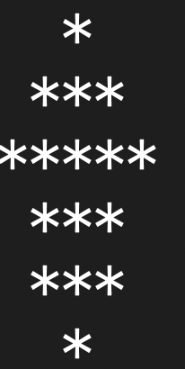
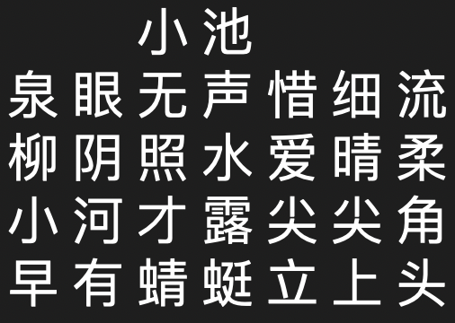

## 初识Python
###1. Python来源
**(1)2018年编程语言互动排行榜**  
  
**(2)读音：【ˈpaɪθən】**  
**(3)来源：**
>Python的创始人为荷兰人吉多·范罗苏姆 （Guido van Rossum）。1989年圣诞节期间，在阿姆斯特丹，Guido为了打发圣诞节的无趣，决心开发一个新的脚本解释程序，作为ABC 语言的一种继承。之所以选中Python（大蟒蛇的意思）作为该编程语言的名字，是取自英国20世纪70年代首播的电视喜剧《蒙提.派森的飞行马戏团》（Monty Python's Flying Circus）。
###2. Python能做什么
  
**一句话：什么都能做**
###3. 认识Python交互模式
>IDLE是一个Python的集成开发和学习环境，包括Python Shell和Python Editor两部分。
其中，Python Shell是一个Python解释器的外壳程序，提供逐行输入和执行Python代码的
交互模式，非常便于学习Python编程；Python Editor是一个Python代码编辑器，提供撤销
和恢复功能、代码高亮显示、自动缩进、关键字提示和自动完成等诸多功能。
###4. 认识Python第一个函数（输出）

>思考： 
1.如何打印多个hello world  
2.每个hello world之间有空格

问题1:  
  
问题2:  

练习(1)： 
>编写Python程序，将下面的图案输出到屏幕上。： 

 
练习(2)： 
>编写Python程序，将宋朝诗人杨万里创作的一首七言绝句《小池》输出到屏幕上： 

