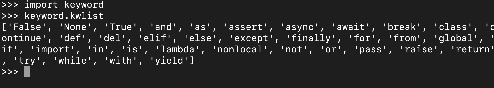

## 变量
### 1. 什么是变量
>在Python中，如果希望程序记住某个东西，以便你以后使用，所要做的就是给这个“东西”起一个名字。

``` python
>>> Teacher="张老师"
>>> print(Teacher)
张老师
>>> 
```
* 我们可以把变量比喻成我们生活中的标签、购物车<br/>
<p></p>


<p></p>
>在一个东西两边加上引号时，Python会按字面来处理它。它会把引号里面的内容原样打印出来。
如果没有引号，Python就必须明确这个东西到底是什么。

``` python
>>> print("53+28")
53+28
>>> print(53+28)
81
>>> 
```
* **我们把在双引号或单引号中数据称为字符串** 

### 2. 不一样的变量

``` python
>>> num=7
>>> num=num+1
>>> print(num)
8
>>> 
```
### 3. 变量的命名规则
* **变量名由字母、数字、下划线组成，且不能以数字开头**
>思考一下下列哪些变量名是错误的？<br>
aa <br>
2n<br>
_su<br>
$rr <br>
print <br>

### 4. 关键字
>python自己保留的名字，这些名字是不能够作为变量名的<br>


---

<font style="font-size: 24px;color: red;font-weight: 700">练习(1)：</font><br/>
>如果一天有26个小时，那么一周会有多少分钟呢？<br>
**要求：**
<p style="color:red"> 创建3个变量，一个代表一天有几个小时，一个代表一周有几天，一个代表一周会有对少分钟（也就是结果），将结果打印出来。</p>


