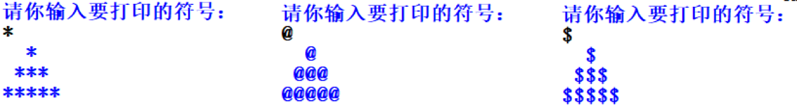

## 输入
### 1.input()函数
>input()函数从用户那里得到一个字符串。

* 第1种用法
```python
print("请输入你的名字：")
name=input()
print(name+"，你长的可帅！")
```
>运行结果：<br>
请输入你的名字：<br>
猪八戒<br>
猪八戒，你长的可帅！<br>

* 第2种用法-打印内容不要print函数
```python
name=input("请输入你的名字：")
print(name+"，你长的可帅！")
```
>运行结果：<br>
请输入你的名字:齐天大圣：<br>
齐天大圣，你长的可帅！<br>

<font style="font-size: 24px;color: red;font-weight: 700">练习(1)：</font><br/>
>已知华氏温度转化为摄氏温度的公式如下：<br>
C=(F-32)*5/9 <br>
其中，C 为摄氏温度，F 为华氏温度，编程实现将任意输入的华氏温度值转换成摄氏温度值输出。<br>

<font style="font-size: 24px;color: red;font-weight: 700">练习(2)：</font><br/>
>给定一个字符（输入任意一个字符），用它构造一个底边长5个字符，高3个字符的等腰字符三角形。<br>

®


