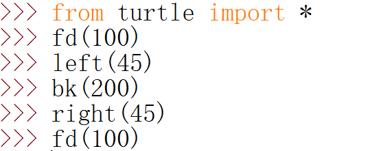
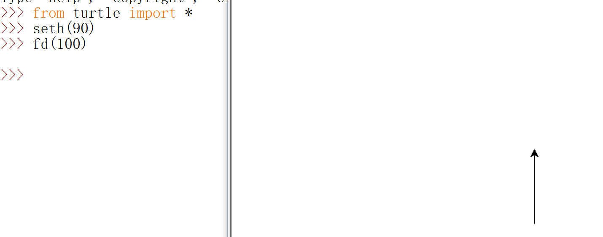
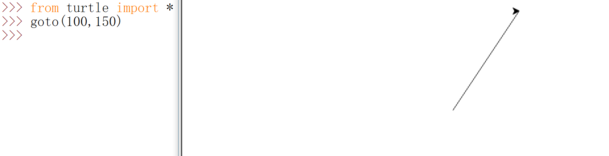
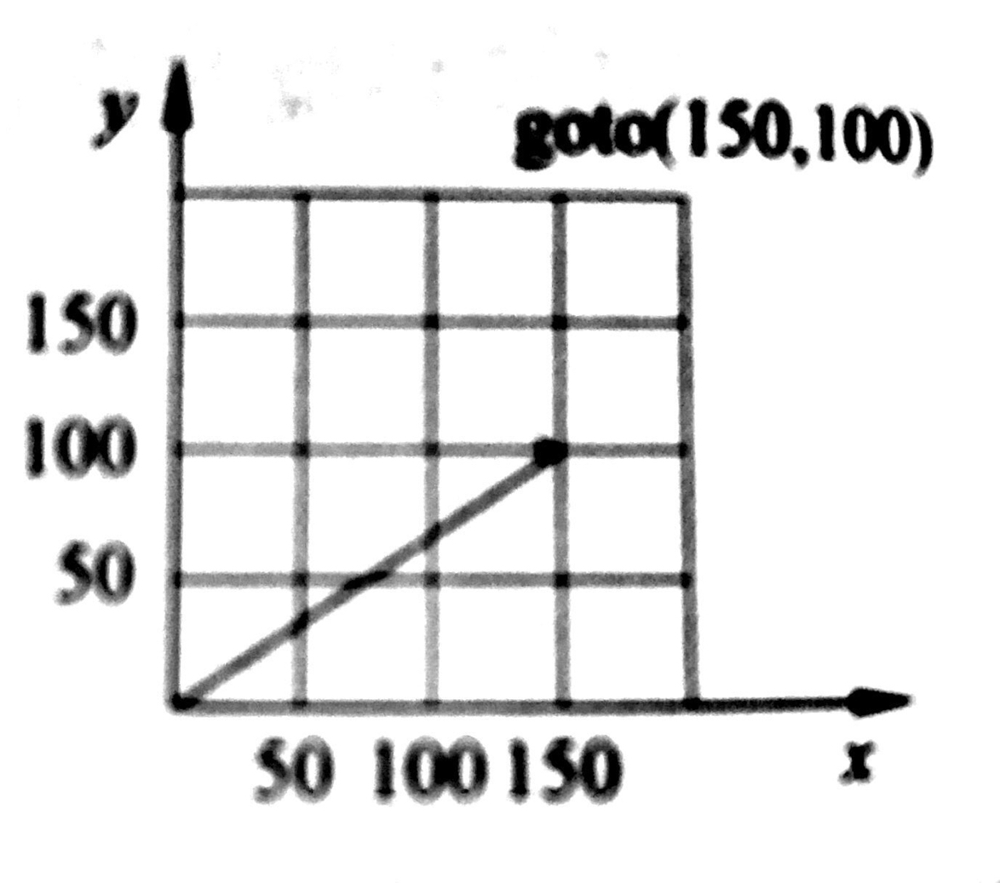
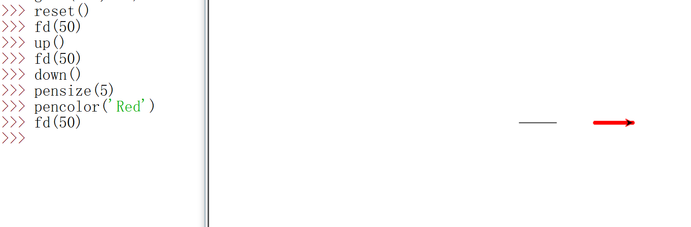
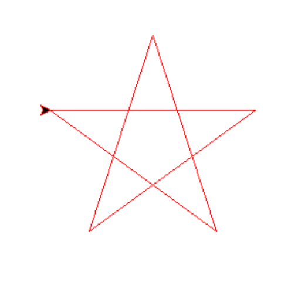

## 初识海龟绘图
### 1.什么是海龟绘图？
>海龟绘图是Python语言内置的绘图模块，是早期的LOGO编程语言在Python语言中的实现。
使用这个模块绘图时，可以把屏幕当成一块画布，通过控制一个小三角（或小海龟）的画笔
在画布上移动，从而在它前进的路径上绘制出图形。

### 2.基本使用 
**使用前先导入**
```
import turtle
turtle.fd(100)
from turtle import *
fd(100)
``` 
### 3.相对运动
> 在海龟绘图中，提供了一些函数用于控制画笔的前进、旋转和方向。
> 例如，例如fd()函数让画笔前进，bk()函数让画笔后退，left()函数让画笔左转，right()函数让画笔右转，seth()函数用来设置画笔前进的方向。

 <br>
 <br>
 <br>

<font style="font-size: 24px;color: red;font-weight: 700">练习(1)：</font><br/>
>画出“H”字形的轨迹<br>
### 4.绝对运动 
> 在海龟绘图中，画布坐标系原点（0，0）位于画布正中央。使用goto()函数，可以将画笔精确地移动到
> 画布的某个位置。

<br>
<br>

### 5.画布和画笔的设置
> 在海龟绘图中，up()函数让画笔抬起，down()函数画笔落下，使用pensize()函数设置画笔的大小
> ，使用pencolor()函数设置画笔的颜色，画笔的默认颜色为黑色。
<br>
<font style="font-size: 24px;color: red;font-weight: 700">练习(2)：</font><br/>
>画出一个五角星<br>



