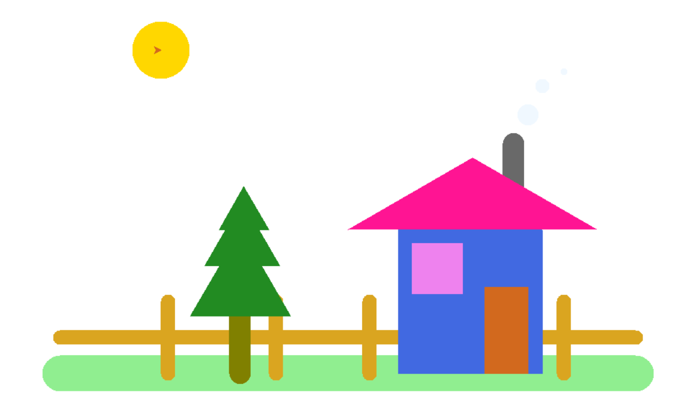

## 创意绘图
###美丽村庄 

###参考代码
```
from turtle import *
#隐藏画笔
#ht()
#调整绘图速度
speed(1)
#1.大地，画一条长为800像素的线段，画笔大小为50像素，填充颜色为‘lightgreen’
pensize(50)
pencolor('lightgreen')
up()
goto(-400,-200)
down()
goto(400,-200)
#2.栅栏。栅栏可以解为1条横线和四条竖线，画笔大小为20像素，颜色为‘goldenrod’
pensize(20)
pencolor('goldenrod')
#第一步
up()
goto(-400,-150)
down()
goto(400,-150)
#第二步
up()
goto(-250,-200)
down()
goto(-250,-100)
#----------
up()
goto(-100,-200)
down()
goto(-100,-100)
#----------
up()
goto(30,-200)
down()
goto(30,-100)
#----------
up()
goto(300,-200)
down()
goto(300,-100)
#3.画树。树可以分解为树干和树冠
#树干，画一条长为80像素的线段，大小为30像素，颜色为'olive'
pensize(30)
pencolor('olive')
up()
goto(-150,-200)
down()
goto(-150,-120)
#树冠，分别以半径为80，60和40画出圆的内切正3边形，填充颜色为‘forestgreen’
pensize(1)
color('forestgreen')
up()
goto(-80,-120)
down()
begin_fill()
seth(60)
circle(80,steps=3)
end_fill()
up()
goto(-95,-50)
down()
begin_fill()
seth(60)
circle(60,steps=3)
end_fill()
up()
goto(-110,0)
down()
begin_fill()
seth(60)
circle(40,steps=3)
end_fill()
#4.画房子。房子可以分解为墙体、房顶、窗户、门和烟囱
#房子的墙体。画出一个边长为200像素的正方形，填充颜色为‘royalblue’
pensize(1)
color('royalblue')
up()
home()
fd(70)
right(90)
down()
begin_fill()
fd(200)
left(90)
fd(200)
left(90)
fd(200)
end_fill()
#烟囱，画一个长为90像素的线段，画笔大小为30像素，颜色为"dimgray"
pensize(30)
pencolor('dimgray')
up()
goto(230,30)
down()
goto(230,120)
#房顶，画一个底角为30度，腰为200像素的等腰三角形，填充颜色为'deeppink'
pensize(1)
color('deeppink')
up()
home()
down()
begin_fill()
left(30)
fd(200)
right(60)
fd(200)
end_fill()
#窗户，画一个半径为50像素的圆的内切正四边形，填充颜色为‘violet’
color('violet')
up()
goto(160,-90)
begin_fill()
seth(45)
circle(50,steps=4)
end_fill()
#门，画一个长120像素，宽60像素的长方形，填充颜色"chocolate"
color("chocolate")
up()
goto(250,-200)
down()
seth(90)
begin_fill()
fd(120)
left(90)
fd(60)
left(90)
fd(120)
left(90)
fd(60)
end_fill()
#5.炊烟和太阳
#炊烟，画3个依次变小的圆点，颜色为aliceblue
up()
goto(250,160)
dot(30,'aliceblue')
goto(270,200)
dot(20,'aliceblue')
goto(300,220)
dot(10,'aliceblue')
#太阳。画一个80像素的圆点，颜色为'gold'
goto(-260,250)
dot(80,'gold')
```


