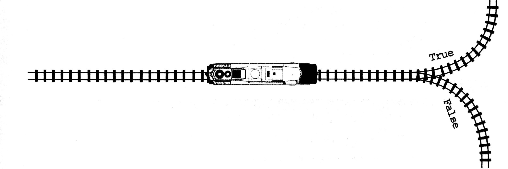
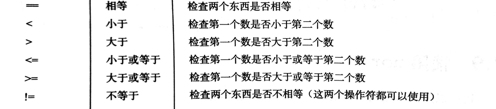

## 分支结构——判断再判断
### 1.什么是分支结构？
>前面我们所写的所有程序都是从上往下执行的，我把这种结构叫做顺序结构。如果一个程序每次做同样的
事情，这会有些枯燥，而且用处不大。程序要能够决定接下来做什么，根据输入能够做不同的事情。<br>
<font style="color:red">例子：</font><br>
如果今天我开心，就吃点好的！<br>
如果张三给出的答案是正确的，就为他加1分<br>
如果文件没找到，就显示错误信息<br>

<br>
### 2.基本形式
```
if 条件:
    满足条件要做的事情1
    满足条件要做的事情2
    满足条件要做的事情3
    满足条件要做的事情4
else:
    条件不满足时要做的事情1
    条件不满足时要做的事情2
    条件不满足时要做的事情3
    条件不满足时要做的事情4
```

### 3.比较操作符 
**条件：**只有两种情况：True和False，一般我们用比较操作符来得出条件是真或者是假<br>
<br> 
```
#1.年龄大于18岁的可以进入网吧
age=int(input("请刷身份证："))
if age>18:
    print("你可以进入网吧了！")
#2.年龄大于18岁的可以进入网吧，其它告诉他要好好学习！
if age>18:
    print("你可以进入网吧了！")
else:
    print("你要好好学习啊！")
```
<font style="font-size: 24px;color: red;font-weight: 700">练习(1)：</font><br/>
>从键盘输入刀子的长度，如果刀子的长度没有超过10cm允许上火车，否则不允许上火车<br>

### 4.elif
>if能当满足xxx条件时，做某件事情<br>
if else 能当满足xxx条件时，做某件事情，不满组时做另一件事情<br>
想一想有这样的一种情况：xxx1时做事情1，xxx2时做事情2，xxx3时做事情3,那该怎么实现呢？ <br>

####elif的使用格式
```
if xxx1:
    事情1
elif xxx2:
    事情2
elif xxx3:
    事情3
```
#### elif的使用注意点
1.必须和if一起使用<br>
2.可以和else一起使用：<br>
```
if xxx1:
    事情1
elif xxx2:
    事情2
elif xxx3:
    事情3
else xxx4:
    事情4
```
```
#成绩大于80优秀，大于60及格，其它不及格
score=70
if score>80:
    print("优秀")
elif score>60:
    print("及格")
else:
    print("不及格")
```
<font style="font-size: 24px;color: red;font-weight: 700">练习(2)：</font><br/>
>从键盘录入，身高小于1.2米火车免票，等于1.2半票，其它全票<br>


