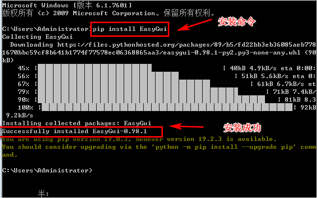

## GUI——图形用户界面
### 1.什么是GUI？
>GUI是Graphical User Interface（图形用户界面）的缩写。在GUI中，并不只是键入文本和返回文本，
用户可以看到窗口、按钮、文本框等图形，而且可以用鼠标点击，还可以通过键盘输入。
我们目前为止完成的程序都是命令行或文本模式程序。GUI是与程序交互的一种不同方式。
我们一直都在使用GUI,实际上已经用过很多。浏览器是GUI，IDLE也是GUI，QQ也是GUI。

### 2.EasyGui 
>EasyGui 是一个Python模块，利用这个模块可以很容易地建立简单的GUI。
import XXX 就是在使用模块，模块就是一种扩展方法，帮助我们实现某种功能。
Python内置的模块直接import XXX就可以使用，外置的必须安装，比如我们用到的EasyGui就需要安装。

#### 安装外置扩展模块的方法
```
pip install 模块的名字
pip install EasyGui
```

### 3.msgbox 
```
import easygui
easygui.msgbox("hello world!",title="我是标题",ok_button="随便改")
```

### 4.buttonbox
1.一般用法<br>
```
import easygui
color=easygui.buttonbox("你最喜欢的颜色是什么？",choices=["红色","蓝色","黄色"])
easygui.msgbox("你最喜欢的颜色是"+color)
```
 <br>
2.带image属性
```
import easygui
color=easygui.buttonbox("你能吃辣吗？",choices=["还行","不能吃辣","特别喜欢"],image="la.gif")
easygui.msgbox("你对辣椒的承受程度:"+color,image="la.gif")
```
 <br>
####gif图
 <br>

### 5.choicebox
```
import easygui
color=easygui.choicebox("你能吃辣吗？",choices=["还行","不能吃辣","特别喜欢"])
easygui.msgbox("你对辣椒的承受程度:"+color)
```


### 6.enterbox
```
import easygui
color=easygui.enterbox("你最喜欢的颜色是？")
easygui.msgbox("你最喜欢的颜色是:"+color)
```

### 改进版的猜拳小游戏
用buttonbox和msgbox去实现<br>
 <br>
####gif图片
 <br>


