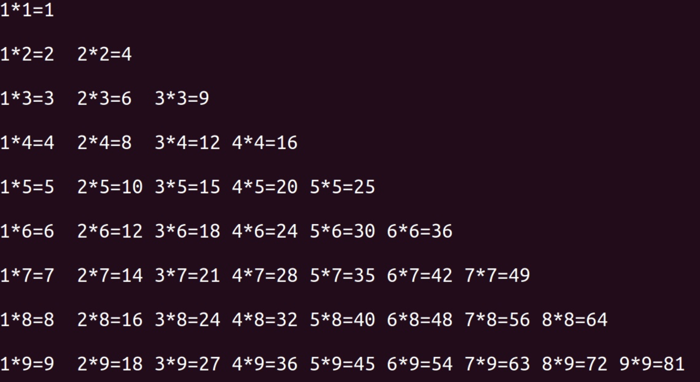

## 循环嵌套
### 1.什么是循环嵌套？
>在一个循环结构中包含另一个循环结构，称为循环嵌套。

```
i=1
while i<=3:
    j=1
    while j<=3:
        print("*",end="")
        j+=1
    print()
    i+=1
```
```
i=1
while i<=3:
    j=1
    while j<=i:
        print("*",end="")
        j+=1
    print()
    i+=1
```
### 补充知识点：格式化字符串
```
age=18
print("我今年%d岁"%(age,length))
```
```
age=18
name="张三"
height=1.8
print("我叫%s，今年%d岁了，身高%f米"%(name,age,height))
```
```
age=18
name="张三"
height=1.8
print("我叫%s，今年%-2d岁了，身高%f米"%(name,age,height))
```
<font style="font-size: 24px;color: red;font-weight: 700">练习：打印九九乘法表</font><br/>

</img>


